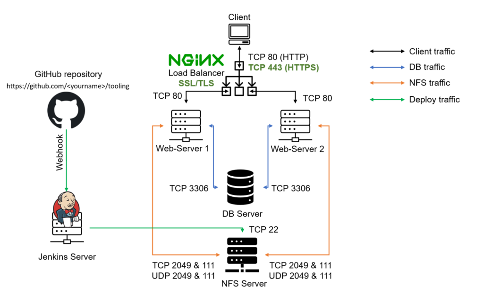
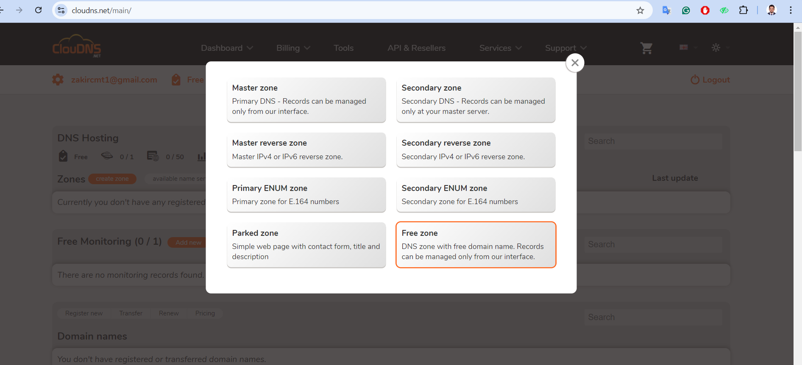

# Load Balancer Solution With Nginx and SSL/TLS

A Load Balancer (LB) distributes clients' requests among underlying Web Servers and makes sure that the load is distributed in an optimal way.
In this project, we will configure an [Nginx](https://www.f5.com/go/product/welcome-to-nginx) Load Balancer Solution.

It is extremely important to ensure that connections to our Web Solutions are secure and information is [encrypted in transit](https://security.berkeley.edu/data-encryption-transit-guideline). Connection over secured HTTP (HTTPS protocol), it's purpose and what is required to implement it will be covered.

## Task
This project consist of two parts:
1. Configure Nginx as a Load Balancer
2. Register a new domain name and configure secure connection

The diagrame below shows the architecture of the solution



# Part 1 - Configure Nginx As A Load Balancer

 ### 1. Create an EC2 VM based on Ubuntu Server 24.04 LTS and name it Nginx-LB-Server

 

 __Open TCP port 80 for HTTP connections and TCP port 443 for secured HTTPS connections__

 


### 2. Update ``/etc/hosts`` file for local DNS with Web Servers' names (e.g ``webserver1`` and ``webserver2``) and their local IP addresses

__Access the instance__

```bash
ssh -i "my-server-key.pem" ubuntu@54.158.160.74
```


__Update the hosts file__

```bash
sudo vi /etc/hosts
```


### 3. Install and configure Nginx as a load balancer to point traffic to the resolvable DNS names of the webservers

__Update the instance__

```bash
sudo apt update && sudo apt upgrade -y
```


__Install Nginx__

```bash
sudo apt install nginx -y
```


### 4. Configure Nginx-LB-Server using the Web Servers' name defined in /etc/hosts

This [blog](https://linuxize.com/post/how-to-edit-your-hosts-file/) provides more information about /etc/hosts

__Open the default Nginx configuration file__

```bash
sudo vi /etc/nginx/nginx.conf
```

__Insert the following configuration in http section__

```nginx
    upstream myproject {
       server webserver1 weight=5;
       server webserver2 weight=5;
    }

    server {
        listen 80;
        server_name www.domain.com;

        location / {
            proxy_pass http://myproject;
        }
    }
    # comment out this line
    # include /ete/nginx/sites-enabled/
```


__Test the server configuration__

```bash
sudo nginx -t
```


__Restart Nginx and ensure the service is up and running__

```bash
sudo systemctl restart nginx
sudo systemctl status nginx
```


# Part 2 - Register a new domain name and configure secured connection using SSL/TLS certificates

In order to get a valid SSL certificate we need to register a new domain name, we can do it using any Domain name registrar - a company that manages reservation of domain names. The most popular ones are: [Godaddy.com](https://www.godaddy.com/en-uk), [Domain.com](https://www.domain.com/), [Bluehost.com](https://www.bluehost.com/).


### 1. Register a new domain name with any registrar of your choice in any domain zone. (e.g .com, .net, .org, .edu, info, .xyz or any other)

[Cloudns.net](https://www.cloudns.net/) is the domain name registrar used for this project.





### 2. Allocate Elastic IP address to our (Nginx-LB-Server) server and associate our domain name with this Elastic IP

This is neccessary in order to have a static IP address that does not change after reboot.

## Note: Allocating an Elastic IP from a different network border group than your EC2 instance’s Availability Zone (AZ) could cause minor latency issues, as traffic needs to traverse between zones. However, it won’t prevent the Elastic IP from functioning, as AWS allows cross-AZ connections. For optimal performance, it’s recommended to allocate an Elastic IP from the same network border group as your instance.


__Associate the elastic IP with Nginx-LB-Server__


### 3. Update or create A record your registrar to point to Nginx-LB-Server using the elastic IP


__Use [nds checker](https://dnschecker.org/#A/www.toolingweb.ip-dynamic.org) to Verify the DNS record__


__Access the instance__

## Note: After associating an Elastic IP, the Nginx Load Balancer server's IP has changed. To access the instance, use the new Elastic IP: 52.4.16.207 for SSH connection.

```bash
ssh -i "my-server-key.pem" ubuntu@52.4.16.207
```

### 4. Configure Nginx to recognize your new domain name

Update your ``nginx.conf`` with ``server_name www.<your-domain-name.com`` instead of ``server_name www.domain.com``

In our case, the server_name is ``www.toolingweb.ip-dynamic.org``

```bash
sudo vi /etc/nginx/nginx.conf
```


__Restart Nginx__

```bash
sudo nginx -t
sudo systemctl restart nginx
```


__Check that the Web Server can be reach from a browser with the new domain name using HTTP protocol__.

```bash
http://<your-domain-name.com>
```


### 5. Install [certbot](https://certbot.eff.org/) and request for an SSL/TLS certificate

__Ensure [snapd](https://snapcraft.io/snapd) service is active and running__

```bash
sudo systemctl status snapd
```


__Install certbot__

```bash
sudo snap install --classic certbot
```


### Request SSL/TLS Certificate

__Create a Symlink in `/usr/bin` for Certbot__: Place a symbolic link in this `PATH` to make it easier to run `certbot` from the `command line` without needing to specify its full path.

```bash
sudo ln -s /snap/bin/certbot /usr/bin/certbot
```
Follow the certbot instructions you will need to choose which domain you want your certificate to be issued for, domain name will be looked up from `nginx.conf` file so ensure you have updated it on step 4.

```bash
sudo certbot --nginx  # Obtain certificate
```


### Test secured access to your Web Solution by trying to reach `https://<your-domain-name.com>`.

You shall be able to access your wesite using HTTPS protocol (Uses `TCP port 443`) and see a padlock image in your browsers' search string. `Click on the padlock icon` and you can see the detail of the certificate issued for the website.


### 6. Set up periodical renewal of your SSL/TLS certificate

By default, `LetsEncrypt` certificate is valid for 90 days, so it is recommended to renew it at least every 60 days or more frequently.

__Test the renewal command in `dry-run` mode__

```bash
sudo certbot renew --dry-run
```


__Best pracice is to have a scheduled job that runs `renew` command periodically. Configure a `cronjob` to run the command twice a day__

__Edit the `crontab` file__

```bash
crontab -e
```


__Add the following line to scheduled a job that runs renew command twice daily__

```bash
* */12 * * *   root /usr/bin/certbot renew > /dev/null 2>&1
```


You can always change the interval of the cronjob if twice a day is too often by adjusting the schedule expression.

Resources on cron configuration:

[#30 - Job Scheduling (cronjob/crontab) on Linux CentOS 8](https://www.youtube.com/watch?v=4g1i0ylvx3A)

[Online cron expression editor](https://crontab.guru/)


